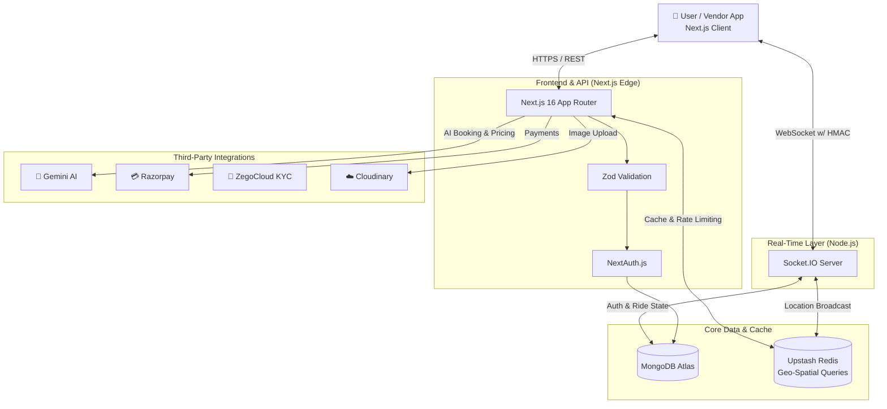

# 🚗 RYDEX — AI-Powered Full-Stack Vehicle Booking Platform

<div align="center">


**A production-grade, AI-powered ride-booking platform built with Next.js 16 App Router, real-time Socket.IO tracking, Gemini AI integration, Razorpay payments, Video KYC, and a complete 8-step multi-role vendor onboarding pipeline.**

### 🌐 [Live Demo → https://rydex-booking-jet.vercel.app](https://rydex-booking-jet.vercel.app)

[Features](#-features) · [Tech Stack](#-tech-stack) · [Architecture](#-architecture) · [AI Integration](#-ai-integration) · [Getting Started](#-getting-started) · [Push to GitHub](#-pushing-to-github) · [Deployment](#-deployment) · [API Reference](#-api-reference)

</div>

---

## 📌 Project Overview

Rydex is a **full-stack, enterprise-grade vehicle booking platform** that lets users book rides across multiple vehicle types — bikes, autos, cars, trucks, and loading vehicles — while empowering vehicle owners to monetise their fleet through a structured, AI-assisted vendor onboarding flow. It is built to scale horizontally, utilizing an event-driven microservices architecture with in-memory Redis caching, cryptographic websocket security, and distributed tracing.

The platform serves **three distinct user roles**:
- 👤 **Users** — book rides, track drivers in real-time, pay online
- 🚗 **Vendors / Partners** — list vehicles, complete KYC, manage bookings and earnings
- 🛡️ **Admins** — review applications, approve vendors, manage the platform

---

## ✨ Features

### 👤 Users
| Feature | Description |
|---|---|
| 🧠 **NLP Booking Assistant** | Type in plain English — AI parses the intent into a structured booking |
| 🗺️ **Real-time Tracking** | Live driver location via Socket.IO with throttled GPS updates |
| 🔐 **OTP Registration** | Secure SMTP-based email OTP verification |
| 🔑 **Google OAuth** | One-click sign-in via Google |
| 💳 **Razorpay Payments** | Seamless in-app payment with signature verification |
| 📋 **Booking History** | View and manage all past and active bookings |

### 🚗 Vendors / Partners
| Feature | Description |
|---|---|
| 🏗️ **8-Step Onboarding** | Vehicle → Documents → Bank → Review → Video KYC → Pricing → Final Review → Live |
| 🔁 **Smart Resumption** | Always redirects to the correct step — never restarts from scratch |
| 🤖 **AI Document KYC** | Gemini Vision analyses Aadhaar, Driving Licence & RC Book automatically |
| 🎥 **Video KYC** | Live face verification via ZegoCloud |
| 📊 **Earnings Dashboard** | Real-time chart, ride metrics, and booking history |
| 💹 **AI Surge Pricing** | Dynamic multiplier based on demand, weather, and time |

### 🛡️ Admins
| Feature | Description |
|---|---|
| 👥 **Vendor Management** | Review, approve, or reject vendor applications |
| 🚘 **Vehicle Approvals** | AI-generated vehicle risk analysis and summary |
| 📈 **Platform Earnings** | Platform-wide earnings and analytics overview |

### 🚀 Production Reliability & Architecture
| Feature | Description |
|---|---|
| 🏎️ **Redis Geo-Spatial Queries** | High-frequency driver GPS locations are decoupled from MongoDB and stored in Upstash Redis (`GEOADD`/`GEORADIUS`) for millisecond lookups. |
| 🛡️ **HMAC Socket Security** | Next.js API generates secure HMAC SHA-256 signatures for socket authentication, preventing malicious spoofing on the decoupled Node.js server. |
| 📉 **Graceful Degradation** | React front-end automatically falls back to an intelligent HTTP polling mechanism if the WebSocket connection drops during a ride or payment. |
| 🚦 **Redis Rate Limiting** | Sliding-window rate limiter prevents DDoS attacks and API abuse on critical endpoints (e.g., booking creation). |
| 🐞 **Distributed Tracing** | Sentry integration captures unhandled promises, slow DB queries, and crashes across both the Next.js Edge and Node.js instances. |

---

## 🛠 Tech Stack

| Category | Technology |
|---|---|
| **Framework** | Next.js 16.1 (App Router + Turbopack) |
| **Language** | TypeScript 5 (strict) |
| **Styling** | Tailwind CSS v4 |
| **Animations** | Framer Motion 12 |
| **State Management** | Redux Toolkit + React-Redux |
| **Database** | MongoDB Atlas via Mongoose 9 |
| **Authentication** | NextAuth.js v5 (Credentials + Google OAuth) |
| **Real-time** | Socket.IO 4.8 (dedicated Express server) |
| **In-Memory Cache** | Upstash Redis (ioredis) |
| **Monitoring** | Sentry (`@sentry/nextjs`, `@sentry/node`) |
| **AI** | Google Gemini 2.0 Flash (`@google/genai`) |
| **File Storage** | Cloudinary (document + image uploads) |
| **Payments** | Razorpay |
| **Video KYC** | ZegoCloud UIKit |
| **Maps** | React Leaflet |
| **Charts** | Recharts |
| **Email** | Nodemailer (SMTP) |
| **Validation** | Zod (schema-first, all API routes) |
| **HTTP Client** | Axios |

---

## 🏗 Architecture

Rydex uses a **dual-service monorepo** — a Next.js application and a dedicated Socket.IO server — enabling independent scaling of HTTP and real-time workloads.



```
rydex-project/
│
├── rydex/                          # Next.js 16 Application
│   ├── src/
│   │   ├── app/                    # App Router (pages + API routes)
│   │   │   └── api/
│   │   │       ├── ai/             # Gemini AI endpoints
│   │   │       ├── admin/          # Admin management
│   │   │       ├── auth/           # Register, OTP, NextAuth
│   │   │       ├── partner/        # Vendor onboarding + bookings
│   │   │       ├── payment/        # Razorpay create + verify
│   │   │       └── zego/           # ZegoCloud token
│   │   │
│   │   ├── features/               # Feature-sliced UI modules
│   │   │   ├── partner/            # Vendor dashboard + onboarding
│   │   │   ├── home/, book/, admin/, ...
│   │   │
│   │   ├── server/                 # Pure server-side business logic
│   │   │   ├── ai/                 # Gemini service + retry logic
│   │   │   ├── vendor-onboarding/  # Step handlers (vehicle, docs, bank)
│   │   │   ├── auth/               # requireSessionUser() guard
│   │   │   ├── admin/              # Admin review + KYC logic
│   │   │   └── http/               # Zod parseJsonBody + error responses
│   │   │
│   │   ├── shared/                 # Reusable UI (Nav, Footer, GeoUpdater)
│   │   ├── models/                 # Mongoose models
│   │   ├── lib/                    # DB, Cloudinary, Mailer, Socket client
│   │   └── hooks/ redux/           # Custom hooks + Redux slices
│   │
│   └── tests/                      # Node.js built-in test suite
│
└── socketServer/                   # Dedicated Socket.IO Server
    ├── index.js                    # Express + Socket.IO entry point
    └── models/                     # Shared Mongoose models
```

### Design Principles
- **Feature-Sliced Architecture** — each feature is self-contained under `src/features/`
- **Server / Client Separation** — all DB access lives in `src/server/`, never in components
- **Schema-First Validation** — every API endpoint validates input with Zod before touching the DB
- **Auth Guards** — `requireSessionUser()` enforces authentication at the server layer
- **Graceful AI Fallbacks** — `withRetry()` wraps all Gemini calls with exponential backoff for 503 and 429 errors

---

## 🤖 AI Integration

Rydex integrates **Google Gemini 2.0 Flash** across five intelligent features:

### 1. NLP Booking Assistant
```
Input  → "I need a truck from Andheri to Pune for furniture delivery"

Output → {
  "pickup": "Andheri",   "dropoff": "Pune",
  "vehicleType": "truck", "bookingCategory": "delivery",
  "confidence": 0.97,    "missingFields": [],  "safetyFlags": []
}
```

### 2. AI Surge Pricing
```
Context → 2 drivers nearby, 10 pending requests, raining, 11 PM
Output  → { "multiplier": 1.8, "reason": "High demand, low supply, adverse weather" }
```

### 3. Document Vision KYC
Extracts Name, Document Number, and Date of Birth from uploaded Aadhaar, Licence, and RC images using Gemini's multimodal vision API.

### 4. Vendor Document Review (Admin Panel)
Simultaneously analyses all three documents, cross-references names, flags discrepancies, assigns a risk level (`low | medium | high`), and recommends `approve | manual_review | request_resubmission`.

### 5. Admin Summary Generator
Generates structured vendor/vehicle review summaries with key checks and open questions directly in the admin panel.

---

## 🔄 Vendor Onboarding Pipeline

```
┌──────────┐   ┌───────────┐   ┌──────┐   ┌────────┐   ┌───────────┐   ┌─────────┐   ┌──────────────┐   ┌──────┐
│ Vehicle  │ → │ Documents │ → │ Bank │ → │ Review │ → │ Video KYC │ → │ Pricing │ → │ Final Review │ → │ Live │
└──────────┘   └───────────┘   └──────┘   └────────┘   └───────────┘   └─────────┘   └──────────────┘   └──────┘
  Vendor          Vendor        Vendor      Admin          Vendor         Vendor          Admin          Active
```

- Vendors automatically resume from their current step
- Completed steps can be edited without breaking the pipeline
- The partner dashboard shows a real-time progress widget at every stage

---

## ⚡ Real-Time Architecture

```
Browser (GeoUpdater)
  ├── fetch("/api/auth/socket-token")  # Generates HMAC SHA-256 signature
  ├── emit("identity", token)          # Authenticate on socket connect using signature
  └── emit("update-location", coords)  # GPS broadcast (throttled)

socketServer (Express + Socket.IO)
  ├── io.use(verifyHMAC)               # Rejects unauthorized connections
  ├── on("update-location")            
  │   ├── redis.geoadd()               # Writes location to In-Memory Redis
  │   └── io.to(room).emit()           # Broadcasts to listening riders
  └── on("disconnect")                 
      └── redis.zrem()                 # Cleans up stale location data
```

---

## 🚀 Getting Started

### Prerequisites
- Node.js ≥ 20 · npm ≥ 10
- MongoDB Atlas cluster
- Google Cloud project (Gemini API + OAuth)
- Cloudinary account
- Razorpay account (test mode is fine)
- ZegoCloud account

---

### Step 1 — Clone the repo

```bash
git clone https://github.com/your-username/rydex.git
cd rydex
```

---

### Step 2 — Set up the Next.js app

```bash
cd rydex
npm install
```

Create `rydex/.env.local`:

```env
# ── Database ──────────────────────────────────────────────
MONGODB_URL="mongodb+srv://<user>:<pass>@cluster.mongodb.net/rydex?retryWrites=true&w=majority"

# ── Authentication ─────────────────────────────────────────
AUTH_SECRET="run: openssl rand -base64 32"
GOOGLE_CLIENT_ID="your_google_client_id"
GOOGLE_CLIENT_SECRET="your_google_client_secret"

# ── Email / OTP ────────────────────────────────────────────
EMAIL="your_gmail@gmail.com"
PASS="your_gmail_app_password"

# ── Cloudinary ─────────────────────────────────────────────
CLOUDINARY_CLOUD_NAME="your_cloud_name"
CLOUDINARY_API_KEY="your_api_key"
CLOUDINARY_API_SECRET="your_api_secret"

# ── AI ─────────────────────────────────────────────────────
GEMINI_API_KEY="your_gemini_api_key"

# ── Payments ───────────────────────────────────────────────
RAZORPAY_KEY_ID="rzp_test_xxxxxxxxxxxx"
RAZORPAY_KEY_SECRET="your_razorpay_secret"
NEXT_PUBLIC_RAZORPAY_KEY="rzp_test_xxxxxxxxxxxx"

# ── Video KYC ──────────────────────────────────────────────
NEXT_PUBLIC_ZEGO_APP_ID="1234567890"
NEXT_PUBLIC_ZEGO_SERVER_SECRET="your_zego_server_secret"

# ── URLs ───────────────────────────────────────────────────
NEXT_PUBLIC_APP_URL="http://localhost:3000"
NEXT_PUBLIC_SOCKET_SERVER="http://localhost:8000"
```

```bash
npm run dev     # → http://localhost:3000
```

---

### Step 3 — Set up the Socket server

```bash
cd ../socketServer
npm install
```

Create `socketServer/.env`:

```env
MONGODB_URL="same_connection_string_as_above"
PORT=8000
```

```bash
npm run dev     # → http://localhost:8000
```

---

## 📤 Pushing to GitHub

### First-time setup (run from the project root)

```bash
# 1. Navigate to the root folder
cd "rydex project"

# 2. Initialise Git
git init

# 3. Stage all files (gitignore will automatically exclude .env, node_modules, .next)
git add .

# 4. Create the initial commit
git commit -m "feat: initial commit — Rydex full-stack AI ride booking platform"

# 5. Create a new repo on GitHub (https://github.com/new), then:
git branch -M main
git remote add origin https://github.com/YOUR_USERNAME/rydex.git

# 6. Push
git push -u origin main
```

### Subsequent pushes

```bash
git add .
git commit -m "fix: your commit message"
git push
```

### ⚠️ Before every push — verify secrets are NOT tracked

```bash
git status          # make sure .env.local and .env are NOT listed
git diff --cached   # review exactly what will be committed
```

---

## ☁️ Deployment

Rydex has two services to deploy. The recommended stack is:

| Service | Platform | Why |
|---|---|---|
| **Next.js App** | [Vercel](https://vercel.com) | Zero-config, built for Next.js, free tier |
| **Socket.IO Server** | [Render](https://Render.app) | Persistent Node.js process, free starter plan |
| **Database** | MongoDB Atlas | Already set up, free M0 tier |

---

### 🔵 Deploy the Next.js App on Vercel

**Option A — Via Vercel Dashboard (Recommended)**

1. Go to [vercel.com](https://vercel.com) → **Add New Project**
2. Import your GitHub repo
3. Set **Root Directory** to `rydex`
4. Click **Environment Variables** and add every key from your `.env.local` (without the `NEXT_PUBLIC_SOCKET_SERVER` pointing to localhost — update it after deploying the socket server)
5. Click **Deploy**

> **Live deployment**: [https://rydex-booking-jet.vercel.app](https://rydex-booking-jet.vercel.app)

**Option B — Via CLI**

```bash
npm install -g vercel
cd rydex
vercel --prod
```

Follow the prompts. When asked for the root directory, confirm `./`.

> **After deploying**, copy your Vercel production URL (e.g. `https://rydex.vercel.app`) and update the `NEXT_PUBLIC_APP_URL` environment variable in Vercel's dashboard.

---

### 🟣 Deploy the Socket.IO Server on Render

1. Go to [Render.app](https://Render.app) → **New Project → Deploy from GitHub Repo**
2. Select your repo
3. Set **Root Directory** to `socketServer`
4. Add environment variables:
   ```
   MONGODB_URL = your_mongodb_connection_string
   PORT = 8000
   ```
5. Render auto-detects Node.js and runs `npm start`. Make sure `package.json` has:
   ```json
   "scripts": { "start": "node index.js", "dev": "nodemon index.js" }
   ```
6. After deploy, copy the Render public URL (e.g. `https://rydex-socket.up.Render.app`)

7. Go back to **Vercel → Your Project → Settings → Environment Variables** and update:
   ```
   NEXT_PUBLIC_SOCKET_SERVER = https://rydex-socket.onrender.com
   ```
8. Trigger a **Redeploy** on Vercel

---

### 🟢 Configure Google OAuth for Production

1. Go to [Google Cloud Console](https://console.cloud.google.com/) → **APIs & Services → Credentials**
2. Edit your OAuth 2.0 Client
3. Add to **Authorised JavaScript origins**:
   ```
   https://rydex-booking-jet.vercel.app
   ```
4. Add to **Authorised redirect URIs**:
   ```
   https://rydex-booking-jet.vercel.app/api/auth/callback/google
   ```
5. Save

---

### 🟡 Configure Cloudinary CORS (for document uploads)

In your Cloudinary dashboard → **Settings → Upload → Upload presets**, ensure your domain is allowlisted, or use the server-side Cloudinary SDK (already done in this project — no extra config needed).

---

### ✅ Post-Deployment Checklist

```
✅  Next.js app live → https://rydex-booking-jet.vercel.app
✅  Socket.IO server live on Render
✅  NEXT_PUBLIC_SOCKET_SERVER updated to Render URL in Vercel env vars
✅  Vercel redeployed after env var update
✅  Google OAuth redirect URIs updated with production domain
✅  MongoDB Atlas IP Access List includes 0.0.0.0/0 (allow all) for Vercel serverless
✅  Razorpay webhook → https://rydex-booking-jet.vercel.app/api/payment/verify
✅  Test: Registration OTP email received
✅  Test: Google login works
✅  Test: Booking NLP returns structured data
✅  Test: Real-time tracking updates in browser
```

---

## 📡 API Reference

### Auth
| Method | Route | Description |
|---|---|---|
| `POST` | `/api/auth/register` | Register — hashes password, sends OTP |
| `POST` | `/api/auth/verify-otp` | Verify OTP, activate account |
| `GET/POST` | `/api/auth/[...nextauth]` | NextAuth (Google + Credentials) |

### AI
| Method | Route | Description |
|---|---|---|
| `POST` | `/api/ai/parse-booking` | NLP → structured booking JSON |
| `POST` | `/api/ai/pricing` | AI surge price multiplier |
| `POST` | `/api/ai/verify-document` | Verify document image (vision) |

### Partner / Vendor
| Method | Route | Description |
|---|---|---|
| `GET/POST` | `/api/partner/vehicle` | Vehicle onboarding step |
| `GET/POST` | `/api/partner/documents` | Document upload (Cloudinary + AI) |
| `GET/POST` | `/api/partner/bank` | Bank details step |
| `GET` | `/api/partner/bookings` | Vendor's booking history |
| `GET` | `/api/partner/earnings` | Earnings data for chart |
| `POST` | `/api/partner/vehicle/pricing` | Set per-km vehicle pricing |
| `POST` | `/api/partner/bookings/send-pickup-otp` | OTP at pickup point |
| `POST` | `/api/partner/bookings/verify-pickup-otp` | Verify pickup OTP |
| `POST` | `/api/partner/bookings/verify-drop-otp` | Verify drop-off OTP |

### Payments
| Method | Route | Description |
|---|---|---|
| `POST` | `/api/payment/create` | Create Razorpay order |
| `POST` | `/api/payment/verify` | Verify payment signature |

### Admin
| Method | Route | Description |
|---|---|---|
| `GET` | `/api/admin/vendors` | List all vendor applications |
| `GET/PATCH` | `/api/admin/vendors/[id]` | View / approve / reject vendor |
| `GET` | `/api/admin/vehicles` | List all vehicle submissions |
| `GET` | `/api/admin/earnings` | Platform earnings |
| `GET` | `/api/admin/dashboard` | Admin stats overview |

### Misc
| Method | Route | Description |
|---|---|---|
| `GET` | `/api/me` | Get current authenticated user |
| `GET` | `/api/vehicles/nearby` | Find vehicles near coordinates |
| `GET` | `/api/zego/token` | Generate ZegoCloud room token |

---

## 🔐 Security

- **Socket Authentication** — Cross-service WebSocket authentication using **HMAC SHA-256 signatures** (zero-dependency `crypto`).
- **DDoS Protection** — Custom **Sliding-Window Redis Rate Limiter** blocks API spam (e.g., max 3 bookings/min).
- **Graceful Fallbacks** — Client-side UI automatically degrades to smart HTTP polling if the WebSocket server goes offline.
- **Error Monitoring** — **Sentry** automatically captures and alerts on backend crashes, unhandled promises, and React Error Boundaries.
- **Password hashing** — bcryptjs (10 salt rounds)
- **JWT sessions** — encrypted via `AUTH_SECRET` (NextAuth)
- **Auth guard** — `requireSessionUser()` on every protected endpoint
- **Schema validation** — Zod validates every request body before DB access
- **OTP expiry** — Registration OTPs expire after 10 minutes
- **Env protection** — `.env.local` and `.env` are git-ignored
- **AI retry safety** — `withRetry()` handles transient 503/429 errors with exponential backoff (2s → 4s → 6s)

---

## 🧪 Testing

```bash
cd rydex
npm test    # Node.js built-in test runner
```

---

## 🗂 Environment Variables Reference

| Variable | Service | Required |
|---|---|---|
| `MONGODB_URL` | Both | ✅ |
| `AUTH_SECRET` | Next.js | ✅ |
| `GOOGLE_CLIENT_ID` | Next.js | ✅ |
| `GOOGLE_CLIENT_SECRET` | Next.js | ✅ |
| `EMAIL` | Next.js | ✅ |
| `PASS` | Next.js | ✅ |
| `CLOUDINARY_CLOUD_NAME` | Next.js | ✅ |
| `CLOUDINARY_API_KEY` | Next.js | ✅ |
| `CLOUDINARY_API_SECRET` | Next.js | ✅ |
| `GEMINI_API_KEY` | Next.js | ✅ |
| `RAZORPAY_KEY_ID` | Next.js | ✅ |
| `RAZORPAY_KEY_SECRET` | Next.js | ✅ |
| `NEXT_PUBLIC_RAZORPAY_KEY` | Next.js | ✅ |
| `NEXT_PUBLIC_ZEGO_APP_ID` | Next.js | ✅ |
| `NEXT_PUBLIC_ZEGO_SERVER_SECRET` | Next.js | ✅ |
| `NEXT_PUBLIC_APP_URL` | Next.js | ✅ |
| `NEXT_PUBLIC_SOCKET_SERVER` | Next.js | ✅ |
| `PORT` | socketServer | optional (default 8000) |

---

## 🧩 Future Roadmap

- [ ] Mobile app (React Native) with shared business logic
- [ ] Push notifications for incoming ride requests
- [ ] Driver SOS / emergency button
- [ ] Multi-city support with zone-based dynamic pricing
- [ ] Subscription plans for frequent riders
- [ ] Webhook-driven real-time admin notifications

---

## 👨‍💻 Author

**Sk Mijanur Rahaman (skmijanurrahaman1314@gmail.com)**
---

<div align="center">

**Built with Next.js 16 · TypeScript · MongoDB · Socket.IO · Google Gemini AI · Razorpay · ZegoCloud**

⭐ Star this repo if you found it useful!

</div>
